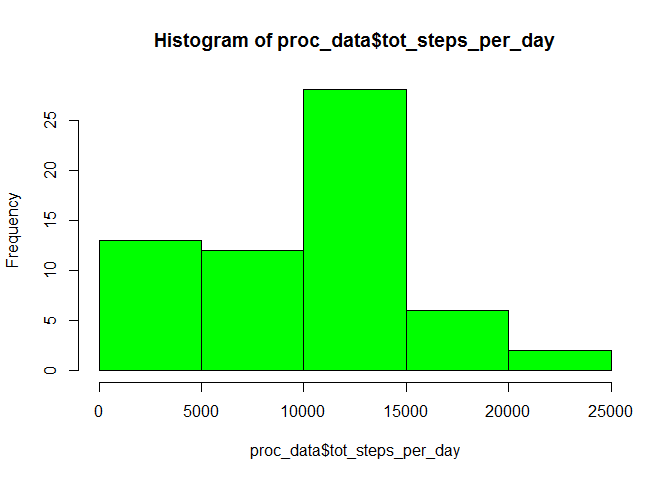
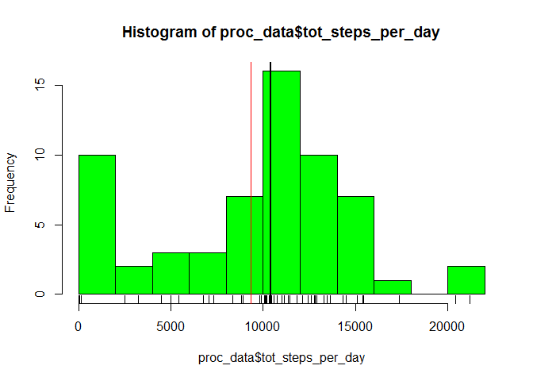
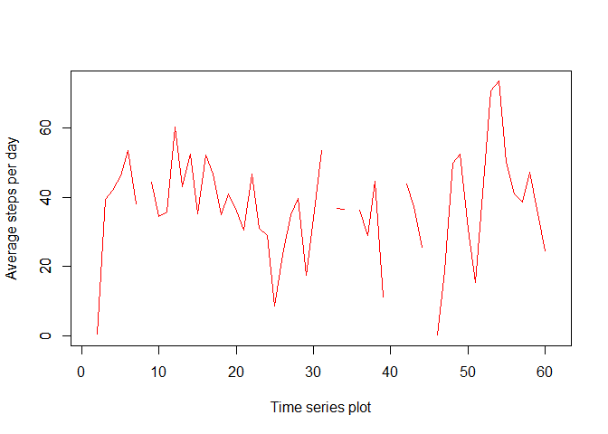
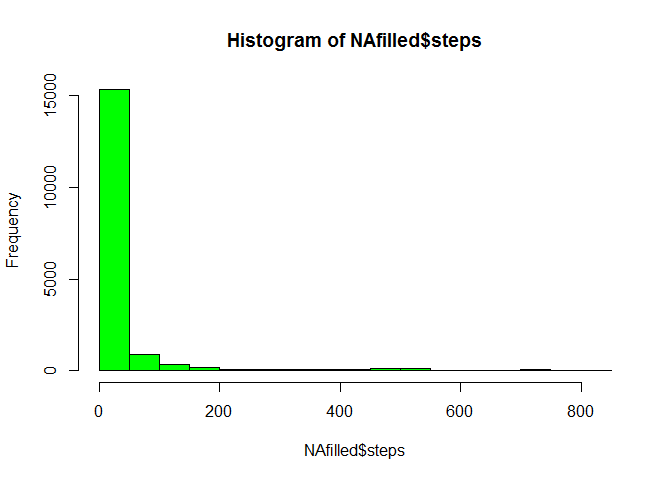
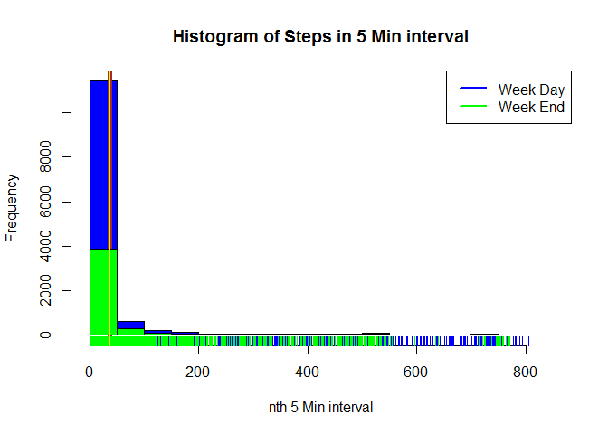
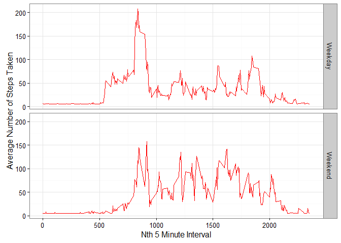

# Reproducible Research: Peer Assessment 1


## Loading and preprocessing the data
First clear the environment and load the requisite libraries.
Then define date variable to be R as.date.


```r
rm(list=ls())
library(dplyr)
```

```
## 
## Attaching package: 'dplyr'
```

```
## The following objects are masked from 'package:stats':
## 
##     filter, lag
```

```
## The following objects are masked from 'package:base':
## 
##     intersect, setdiff, setequal, union
```

```r
library(ggplot2)
setwd("C:\\Users\\rams.m\\Google Drive\\Courseera materials\\Reproducible Research\\Week 1 Project")

raw_data <- read.csv("activity.csv", header = T, na.strings = "NA")

#Convert date column, currently factor, to date.
raw_data$date = as.Date(raw_data$date)
```

Now examine the data.


```r
str(raw_data)
```

```
## 'data.frame':	17568 obs. of  3 variables:
##  $ steps   : int  NA NA NA NA NA NA NA NA NA NA ...
##  $ date    : Date, format: "2012-10-01" "2012-10-01" ...
##  $ interval: int  0 5 10 15 20 25 30 35 40 45 ...
```

Check for missing values.


```r
sapply(raw_data, function(x) table(is.na(x)))
```

```
## $steps
## 
## FALSE  TRUE 
## 15264  2304 
## 
## $date
## 
## FALSE 
## 17568 
## 
## $interval
## 
## FALSE 
## 17568
```
Found missing values in Steps variable. Need to account for this later.

## What is mean total number of steps taken per day?

First Summarise the steps data for each date. Create a total steps per day variable and also an average steps taken per day variable.Using dplyr for this. An elegant package for accomplishing tasks like this.


```r
proc_data <- raw_data %>% group_by(date) %>% summarise(tot_steps_per_day = sum(steps, na.rm = T), avg_steps_per_day = mean(steps, na.rm = T))
```

Now plotting a basic histogram of the total steps per day data.


```r
hist(proc_data$tot_steps_per_day, col = "green")
```



```r
#trying 10 intervals...
hist(proc_data$tot_steps_per_day, breaks = 10,col = "green")
rug(proc_data$tot_steps_per_day)
abline(v = 10400, lwd = 2.5)
abline(v = 9354, lwd = 1.5, col = "red")
```



Clearly 0 number of steps seem to be high in number and is skewing
the graph. Do a descriptive of this data.


```r
summary(proc_data$tot_steps_per_day)
```

```
##    Min. 1st Qu.  Median    Mean 3rd Qu.    Max. 
##       0    6778   10400    9354   12810   21190
```
Median is 10400 steps, mean - 9354 steps and max - 21,190, min - 0.

## What is the average daily activity pattern?

First creating a time series plot of average number of steps taken

```r
plot(ts(proc_data[["avg_steps_per_day"]]), col = "red", xlab = "Time series plot", ylab = "Average steps per day")
axis(2,labels = T)
```



Next step is to find average number of steps for each 5 minute interval. Need to group by interval for this and then calculate avg. steps. using *dplyr* for this and creating a new variable *o*

```r
o <- raw_data %>% group_by(interval) %>% summarise(avg_steps = mean(steps, na.rm = T)) 
```

Having found average for each 5 min interval, find which 5 minute interval contains max. number of steps and print first element that contains max. steps


```r
o <- o[order(-o$avg_steps),]
o[1,1]
```

```
## Source: local data frame [1 x 1]
## 
##   interval
##      (int)
## 1      835
```

## Imputing Missing Values

Imputation can be done in many ways. Here, illustrating a simple mean imputation. For this, first imputing with average steps per day for the processed data set.


```r
proc_data$avg_steps_per_day[is.na(proc_data$avg_steps_per_day)] = mean(proc_data$avg_steps_per_day[!is.na(proc_data$avg_steps_per_day)])
```

Using this value for imputing missing rows for original data set.
Now using this for filling missing rows in original data set and in the process creating a new variable.


```r
#a function to return average steps from processed data
h <- function(x) { proc_data$avg_steps_per_day[proc_data$date == x] }
```

Creating a new dataset with missing values filled.


```r
NAfilled <- raw_data
#The actual imputation being done here
for (i in 1: length(NAfilled$steps))
{
  if(is.na(NAfilled$steps[i]))
   NAfilled$steps[i] = h(NAfilled$date[i])
  
}
```

Now do a histogram of total steps in imputed data...


```r
hist(NAfilled$steps, col = 'green')
```



And compute a descriptive for imputed data...


```r
summary(NAfilled$steps)
```

```
##    Min. 1st Qu.  Median    Mean 3rd Qu.    Max. 
##    0.00    0.00    0.00   37.38   37.38  806.00
```

Comparing with missing data descriptive, imputed data mean value remains same. Only third quartile value has changed. Reason is because the imputed value is based on the mean value per day.


## Are there differences in activity patterns between weekdays and weekends?

This requires creating a days of week factor in the following process as a first step.


```r
days_of_week <- weekdays(NAfilled$date, abbreviate = T)
```

Now create a factor variable for weekday, weekend using the above variable.


```r
NAfilled$weekday <- as.character("Weekday","Weekend")
NAfilled$weekday[grepl("Sat|Sun", days_of_week, ignore.case = T)] <- "Weekend"
NAfilled$weekday <- as.factor(NAfilled$weekday)
```

Then we need to filter weekday and weekend Number of steps...


```r
WkDaySteps <- NAfilled$steps[NAfilled$weekday =="Weekday"]
WkEndSteps <- NAfilled$steps[NAfilled$weekday == "Weekend"]
```

Now doing a histogram plot of the steps


```r
with(NAfilled, hist(WkDaySteps,main = paste("Histogram of Steps in 5 Min interval"), xlab = "nth 5 Min interval",col = "blue"))
rug(WkDaySteps, col = "blue")
abline(v = 37.38, lwd = 5, col = "brown")

hist(WkEndSteps,col = "green",add = T)
rug(WkEndSteps, col = "green")
abline(v = 37.38, lwd = 2.5, col = "yellow")

legend(x= "topright", legend = c("Week Day","Week End"), lwd = c(2.5,2.5), col = c("blue", "green"))
```



Now for creating panel plots...


```r
#First summarise 
NAFilledAgg <- NAfilled %>% group_by(weekday, interval) %>% summarise (avg_Steps = mean(steps))

#Then store the graphic layer in a variable called 'ggp'.
ggp <- ggplot(NAFilledAgg, aes(interval, avg_Steps)) + theme_bw() + geom_line(col = "red") + facet_grid(weekday ~ .) + labs(x = "Nth 5 Minute Interval", y = "Average Number of Steps Taken")

#Now output to device
print(ggp)
```



This marks the end of document.

